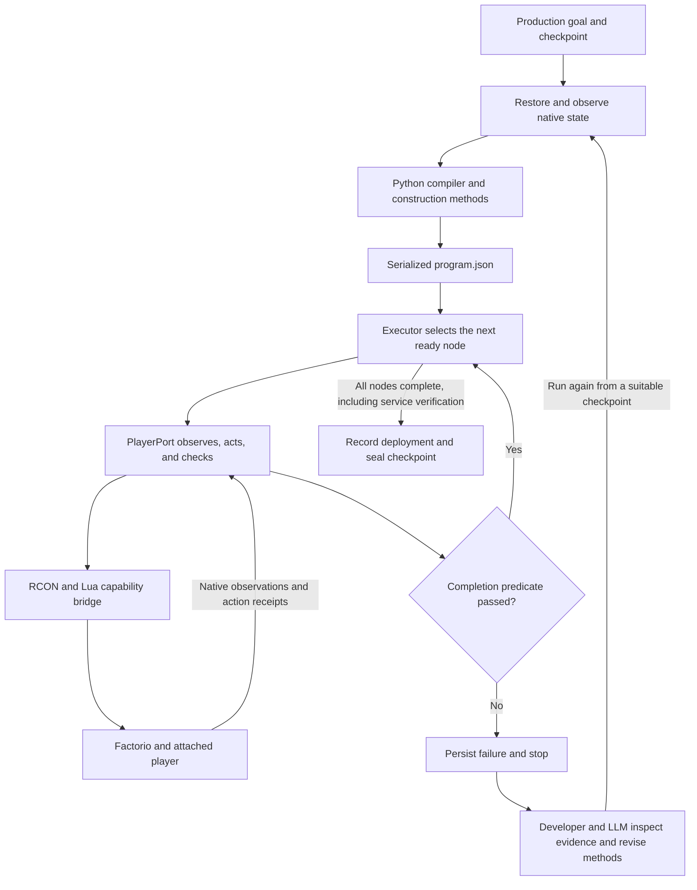

# Game-playing loop architecture

Current implementation and planning baseline, 12 September 2026.

## Objective and current approach

Build a Python constructor that turns a production goal into an executable factory plan, then uses a player tool to construct and verify that factory in Factorio.

```python
Automate("automation-science-pack", per_minute=10)
```

The goal specifies an item and a minimum production rate. Python derives ingredient demand, selects construction methods, sizes machines, generates placements and procurement, and emits a serialized program. The player executor follows that program and checks what happened in the game.

The LLM currently works in the development loop. We use it to implement methods, investigate evidence, and choose experiments. The runtime compiler and executor make no LLM calls. Each run generates a JSON instruction program using existing Python methods. Runtime generation of new Python methods from natural language remains future work.

Today, those methods contain bounded construction knowledge for iron and automation science on the surveyed map. The next architectural step is to compose independently reusable production services from the goal.

## End-to-end loop



There are two feedback timescales. Within a run, Python checks each capability result and advances the program. Between runs, we inspect failures and improve the reusable methods or bridge. A failed program currently returns to that development loop.

The interpreter also supports bounded feedback inside a capability. Walking can try alternative reachable standing points. Startup can wait for buffers to settle. These operations keep their declared purpose and limits.

## Responsibilities

| Layer | Responsibility | Main implementation |
| --- | --- | --- |
| Goal and compilation | Bind a production declaration to an observation and select an applicable output method. | [compiler.py](/Users/tristansaldanha/Documents/Github/blueprint-gen/factory_constructor/compiler.py), [program.py](/Users/tristansaldanha/Documents/Github/blueprint-gen/factory_constructor/program.py) |
| Construction methods | Expand recipes, reuse known supply, calculate machine counts, generate geometry, and derive finite material costs. | [science_method.py](/Users/tristansaldanha/Documents/Github/blueprint-gen/factory_constructor/science_method.py), [production_graph.py](/Users/tristansaldanha/Documents/Github/blueprint-gen/factory_constructor/production_graph.py), [science_layout.py](/Users/tristansaldanha/Documents/Github/blueprint-gen/factory_constructor/science_layout.py), [procurement.py](/Users/tristansaldanha/Documents/Github/blueprint-gen/factory_constructor/procurement.py) |
| Interpreter | Validate the serialized program, schedule ready nodes, and persist their observed outcomes. | [program.py](/Users/tristansaldanha/Documents/Github/blueprint-gen/factory_constructor/program.py) |
| Player tool | Translate a capability into native actions and evaluate its completion predicate. | [player.py](/Users/tristansaldanha/Documents/Github/blueprint-gen/factory_constructor/player.py) |
| Native bridge | Execute bounded walking, mining, crafting, transfers, paid cursor builds, and recipe configuration. Export game observations. | [integration/](/Users/tristansaldanha/Documents/Github/blueprint-gen/factory_constructor/integration), [legacy.py](/Users/tristansaldanha/Documents/Github/blueprint-gen/factory_constructor/legacy.py) |
| Service verification | Reconcile measured production, collection, material consumption, fuel, power, and construction payment. | [verify_science.py](/Users/tristansaldanha/Documents/Github/blueprint-gen/factory_constructor/verify_science.py) |
| Persistence | Record verified entity identities and service evidence; save and validate idle world checkpoints. | [deployment.py](/Users/tristansaldanha/Documents/Github/blueprint-gen/factory_constructor/deployment.py), [checkpoints.py](/Users/tristansaldanha/Documents/Github/blueprint-gen/factory_constructor/checkpoints.py) |

The native bridge runs in an isolated Factorio server with a connected graphical client attached to the original character. Python communicates through local RCON. Actions use instrumented engine APIs and native player attribution, including inventory payment and build events. The executor does not operate desktop buttons or infer state from pixels.

Observations include inventory, position, research, surveyed terrain and resources, supported runtime recipes, entity configuration, and production statistics. The observer catalog selects which mechanics and entities to export. Observation coverage must grow when a new method needs facts outside that catalog.

The constructor still imports planning and execution support from experiments 05–13 through `legacy.py`. That boundary contains working infrastructure, including session management and the iron method. Extracting it into maintained runtime packages is separate from adding production methods.

## Program and execution contracts

`program.json` contains the goal, observation binding, requirements, method provenance, layout, material bill, retained entities, additions, and executable nodes. A node identifies its parent group, prerequisite nodes, operation, inputs, and named completion predicate.

The hierarchy explains why work exists. For example, the science goal owns copper, gear, science, fuel, and electrical construction groups. Dependencies determine when a leaf can run. The current builder chains executable steps in order, and the interpreter executes one ready leaf at a time. The hierarchy does not imply parallel scheduling or general recursive method composition.

The compiler hashes the program and binds it to the observed tick, revision, character, world identity, and captured state. The runner writes the program to JSON and reloads it before execution. This establishes the boundary between plan generation and the player tool.

For each node, `PlayerPort` reads current state, checks retained deployment identities, performs the capability, and checks the resulting evidence. Placement must consume the correct inventory item and produce the expected native entity and build event. A retained placement must preserve identity and spend nothing. Paused commands can share a tick, so revisions and command IDs distinguish their boundaries.

`execution.json` records the active stack, node states, and receipt references. Completion propagates to parent groups only after all their executable descendants pass. An exception or failed predicate stops dependent work and preserves the failed node. Whole-program rollback, automatic replanning, and resuming an arbitrary interrupted node remain unsupported.

## Worked example: 10 automation science per minute

The successful declaration started from a checkpoint with a verified 30 iron plates/minute service, steam power, coal transport, and paid construction inventory.

| Required service | Demand derived from the science goal | Construction decision |
| --- | --- | --- |
| Automation science | 10 packs/min | Two assembling machines, with nominal capacity of 12/min. |
| Gears | 10/min | One assembling machine. |
| Copper plates | 10/min | One copper drill and furnace line. |
| Iron plates | 20/min | Reuse the verified iron service. |
| Fuel and electricity | Supply the connected factory under its added load. | Add a coal drill and distribution connections; reuse steam generation. |

Python generated 158 new placements and retained 60 managed iron entities. The added coal drill feeds the shared collection route and receives startup fuel from the existing coal chest. This connection provides both an automatic start and a continuing route back into the factory's fuel supply.

The program first checks the existing deployment and construction sites. It then verifies or procures construction items, builds and connects the factory, reconciles placements, waits for startup, measures output, and records the result. Procurement is generated from the bill when inventory is insufficient. The successful prepared run required no additional gathering; earlier preparation paid for those items.

The original text-only run produced and collected 12 science packs/minute in each of five measured minutes after eight startup minutes. It produced 150 iron plates, 75 copper plates, and 60 gears during measurement. Coal extraction supplied 150 coal, burners consumed 91, and connected coal stocks gained 59. The complete observed network contained 255 entities, including upstream assets outside the 60 retained iron placements.

That result proves the current method on this surveyed layout over the measured interval. The science method currently accepts an iron deployment as its starting boundary and supports at most 12 packs/minute. Reapplying or expanding an already completed science deployment needs a migration method.

## Evidence required for success

Planning capacity is an estimate. The independent Python verifier checks actual observations from Factorio before recording an output service.

Science startup has a five-minute minimum and a thirty-minute maximum. Its trailing three windows must meet production and collection thresholds. Fresh ingredient supply and fuel reserves must cover that assessed interval. A disconnected route or invalid accounting causes an error; ongoing buffer filling can leave startup pending.

After startup, five fresh, contiguous one-minute windows must pass. The player must stay idle, without transfers or construction. Every minute must produce and collect the declared science rate. Across the interval, new upstream production must cover actual completed consumption, with ingredients in unfinished crafts accounted for.

The verifier checks native resource depletion against mining output, machine counters against recipes, inventory changes against production and consumption, and physical routes against declared connections. It checks all covered burners and requires connected coal and burning-energy reserves to avoid net depletion. Native electrical generation must exceed the finite initial steam and electric reserves.

These checks depend on the instrumented observation scope. They establish a measured service for the managed network. Later declarations must refresh entity state and verify operation under their new load; the stored rate does not reserve capacity for multiple future consumers.

## Checkpoints, artifacts, and recovery

| Artifact | Purpose |
| --- | --- |
| `program.json` | Generated intent, requirements, layout, costs, and capability nodes. |
| `execution.json` | Current stack, node outcomes, and links to action receipts. |
| `actions.json` and native event logs | Command IDs, observed revisions, paid actions, and outcomes. |
| `constructor-opening.json`, samples, and final observation | Native inputs to verification. |
| `constructor-verification.json` | Independently checked production and conservation result. |
| `deployment.json` | Verified entity identities, configurations, and output service evidence. |
| `checkpoint.json`, `game.zip`, and `driver.json` | Sealed save, integrity metadata, exported native state, and driver/command history. |

A `constructor-prepared` checkpoint preserves paid raw materials or construction items before science placement. A `constructor-idle` checkpoint preserves a completed, verified deployment. Restore validates sealed files and prerequisites, then requires exact equality of the exported native checkpoint state and command ledger before continuing.

A restored deployment can provide the starting observation for a newly compiled goal. The saved execution stack is diagnostic information; the interpreter currently starts a new program. Iron reuse and additive expansion work. General migration and recovery from partially built science factories remain future work.

Prerequisite experiments 05–12 are pinned by checkpoint validation. Constructor continuation code can evolve through the scenario overlay, while archived sources remain available for inspection.

The reusable science inputs are [paid construction inventory](/Users/tristansaldanha/Documents/Github/blueprint-gen/factory_constructor/out/checkpoints/science-10-prepared/checkpoint.json) and the [completed factory](/Users/tristansaldanha/Documents/Github/blueprint-gen/factory_constructor/out/checkpoints/science-10/checkpoint.json). The [compressed native evidence](/Users/tristansaldanha/Documents/Github/blueprint-gen/factory_constructor/integration/fixtures/science-10.json.gz) supports verifier regression checks without launching Factorio. A fresh-process restore of the completed checkpoint also passed exact state and ledger checks.

## Development loop and context use

We start with a production declaration and a measurable acceptance condition. We extend a reusable method or capability, check it locally, and run from the nearest useful checkpoint. Python executes the plan and emits a compact report. The LLM reads the report and expands only the relevant failed node, receipt, or observation before making the next change.

Normal experiments use text state and native counters for success measurement. Images are optional presentation output. Actions run at 10× game speed and passive measurement at 40×, following the tested execution policy. Checkpoints avoid repeating procurement, and compressed evidence supports fast verifier iteration.

`--record` captures a native checkpoint replay with a fixed camera and captions. Temporary frames are encoded into MP4/GIF and removed. The replay runs the same constructor and service checks. A previously completed text-only run has no original footage to render later.

## Proposed next phase

The next phase should establish recursive service composition while preserving the serialized program and evidence contracts.

| Current boundary | Proposed change |
| --- | --- |
| The compiler selects one top-level output method. `ScienceMethod` assembles its dependency services explicitly. | Give service methods declared requirements, outputs, applicability conditions, and a common way to generate child plans. |
| Recipe demand can reuse a supplied rate, but the deployment represents one primary service. | Track multiple services, physical endpoints, available capacity, and allocations to consumers. |
| The science method checks installed generation against an added-load budget and verifies the whole network afterward. | Account for existing load and reserve shared fuel, power, and transport capacity during composition. |
| Geometry recognizes the current surveyed opening. | Separate production choices from placement and routing methods, with explicit terrain and connection requirements. |
| Reuse and expansion work for iron; a science deployment cannot yet be extended. | Generate explicit retain, add, and migration operations with observed completion and recovery boundaries. |
| The execution stack is persisted in JSON. | Add a viewer that connects a goal, its generated subgoals, native receipts, and failure evidence. |

A useful first milestone is to extract copper supply and gear assembly into independently callable methods. The science method should then request those services through the same interface. Test 6/min and 10/min declarations from the same prepared-world baseline and verify that composition generates the differing machinery and complete input connections.

A following milestone is a same-world expansion from 6/min to 10/min, followed by repeating the 10/min declaration with zero additional builds. Acceptance should require preserved entity identities, explicit capacity allocations, paid additions, a fresh service proof, and a usable checkpoint after each completed stage.

Before implementing that slice, agree on the service contract fields, the ownership of shared capacity, and the allowed changes to an existing deployment. Those decisions determine the next compiler and player-tool interfaces.
