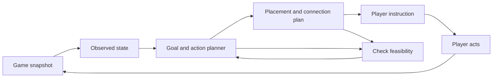

Project review — 2026-09-07

The highest-value next direction is an advisor that observes the game, plans an achievable step,
and checks whether it worked. The blueprint generator is a useful foundation. The main obstacle
to “tell me exactly what to do at every stage” is that the planner currently treats designed
production as achieved production and omits the work needed to construct and operate it.

Working scope for the first complete benchmark: a base-game Nauvis run through the first rocket.
This is a proposed starting scope, not a restriction on the eventual Space Age advisor. A first
rocket, completion of Space Age, and a megabase require different success conditions and plans.

Implementation progress (2026-09-07): [05_advisor_experiment](05_advisor_experiment/README.md)
now contains an isolated snapshot/flow/checklist foundation and a
[read-only game observer/importer](05_advisor_experiment/OBSERVER.md), with
[reproducible results](05_advisor_experiment/EXPERIMENTS.md). A disposable Factorio 2.1.16 scenario
validated machine counters, runtime prototype units, recipe-change rejection, and conservative
import behavior. A separate [survey experiment](05_advisor_experiment/SURVEY.md) now provides
resource coordinates, finite hand-mining targets, obstacle/water maps, and direct connection
diagnostics, checked against another engine scenario. The [route experiment](05_advisor_experiment/ROUTES.md)
now compiles native approaches into walking/mining instructions: an actual character followed a
water-and-wall detour and collected exactly three ore. This is partial progress toward the
observed opening; automatic mining layouts, placement, material routing, power construction,
and complete-opening game validation remain outstanding. The findings below describe the original tools and have
not been silently changed into claims that those tools are fixed.

The next research direction now has two prototypes: a [flat proving ground](05_advisor_experiment/PROVING_GROUND.md)
with configurable rectangular deposits, and [declarative factory revisions](06_declarative_factory/README.md)
with typed ports, stable module addresses, additive blueprint plans, and engine-tested preservation
of existing entities. The [design notes](06_declarative_factory/DESIGN.md) describe how these can
join the finite-opening planner and eventually support nested bus modules and observed deployment state.

The first connection is now [implemented and engine-tested](07_bootstrap_executor/README.md):
the advisor's runtime bill drives surveyed mining, a paid declarative furnace, inventory-conserving
transfers, 50 plates and an observed steam-power unlock. Relocating the iron patch changes routes
and the furnace site without changing the costs. Empty furnaces now remain available for later
jobs without receiving production credit. The next step is persistent observed execution through
copper, power and lab construction. Full red-science output and interactive player building
remain outstanding. Shared benchmark timing confirms accelerated normal-tick simulation already
works directly with Factorio; FLE's speed setting becomes useful for a paced persistent session.

[Persistent execution and recordings](08_live_executor/README.md) now implement that paced session
with `game.speed=40`: real save/restart, idempotent command IDs, copper smelting in the same furnace,
and native lab handcrafting. Tick samples generate GIF/MP4 state replays with action/progress views.
The native standalone character produces the lab in inventory without force-counter or research
credit, so the controller stops for observation. Player attribution is now a concrete integration
question. The user's requested recursive goal/subgoal “stack trace” is recorded in the
[inspection backlog](08_live_executor/TODO.md), alongside native graphical footage.

The separate [player/capture experiment](09_player_capture/README.md) now attaches a connected
player without changing the starter character or inventory. On Factorio 2.1.17, the same native
craft queue receives lab production credit and naturally unlocks the red-science recipe; a
same-version headless control still lacks that credit. Native screenshots now generate GIF/MP4
recordings with action/progress overlays and source hashes. The next instruction is to prepare
a powered lab. Cursor placement, power construction and sustained science remain outstanding.

[Native construction and powered research](10_powered_lab/README.md) now complete the next
finite milestone. The player builds a shoreline pump/boiler/engine/pole/lab system using seven
paid cursor placements including the original furnace. Ten handcrafted red science packs are
consumed by the powered lab to unlock Automation in 100 simulated seconds, with real electrical
energy and native build/craft events retained. Continuous fuel, automated material delivery and
sustained 10-red-science/min production remain the next missing stages.

Reviewed revision: `d0b9fe7`. Local prototype packages identify themselves as version `2.1.14`.
Evidence below comes from code inspection and Python executions against the local data. No
Factorio simulation or human playthrough was run during this review.

**What is already useful**

- Recipe extraction and indexing provide a starting production model.
- Typed blueprint ports, belt-capacity sizing, fluid cells, and bus composition turn production
  requirements into concrete layouts. Preserve this work as the layout component of the advisor.
- `Factory`, `Module`, and `Move` make a good experimental interface for state and recommendations.
- The research dependency walk already handles prerequisite chains and recognizes trigger research.
- The layout experiments have useful negative results: nested buses often cost more area and fail
  to pack; direct links capture some of their benefit at lower cost. Further nesting work should
  follow a measured gameplay need.

I ran `.venv/bin/python 03_blueprint_objects/bench.py --full --jobs 4`: all 28 cases built with
zero recorded regressions. The fluid checks reported 42 clean recipes, zero broken, and four
rejections. The builds still reported 37 warnings. These checks establish structural and size
baselines; they do not establish achievable throughput or an executable game progression.

**Concrete problems to address first**

| Priority | Observed behavior | Cause and practical consequence |
| --- | --- | --- |
| P0 | Six science modules, each requesting 100/min but receiving no ingredients, make `f.next()` return `DONE`. | `Factory.production()` sums requested module output; `goal()` uses that total and exits before checking feasibility. The advisor can declare success for a factory producing nothing. |
| P0 | An automatic run from `Factory()` applies 175 moves and finishes with shortages of water 500/min, coal 100/min, sulfur 25/min, calcite 20/min, and iron plates 5/min. | Final-goal checking precedes shortage repair, and demand expansion is inconsistent with some recipes the planner actually builds. Even its internal progression does not finish in a balanced state. |
| P0 | That run builds heavy oil using Space Age's `simple-coal-liquefaction`, including calcite, while following the base technology tree. | Recipes include several expansions; technologies include only base. The first indexed recipe wins, and an absent unlock path is treated like no research is needed. Availability must be an explicit prerequisite. |
| P0 | The first 20 iron plates/min build becomes one electric furnace plus a medium electric pole, before either is unlocked. The note advises replacing the furnace by hand and says the rates are the same. | Layout support overrides the actual machine tier. One stone furnace makes 18.75 plates/min from the local prototypes, versus 37.5 for an electric furnace. This step needs two stone furnaces, fuel, and a suitable starter layout. |
| P1 | A 900 gears/min module upgraded to assembler 3 and red belts records ten machines and 1,500/min capacity; its exported blueprint contains six machines. | `Module.blueprint()` resizes from `want` at the new tier instead of exporting the recorded hardware. A blueprint can silently perform the rebuild that the API says is a separate operation. |
| P1 | A custom processing-unit target of 1,000/min returns `DONE ... only waiting on labs` when science-ladder demand is externally supplied, including only 66.67 processing units/min. | `goal()` recognizes custom targets, but `demand()` expands only the science ladder. The selected goal's demand never reaches the build planner. |
| P1 | Saving and restoring a petroleum-gas module explicitly using advanced oil processing changes it to basic oil processing. | `Module.to_json()` does not preserve recipe identity; loading reselects the default recipe. State round trips can change resource requirements. |

Relevant implementation points: [production and state](04_game_planner/factory.py),
[goal selection, demand, and move application](04_game_planner/planner.py),
[technology availability](04_game_planner/tech.py),
[recipe sources and ranking](01_recipe_generatpr/recipe.py), and
[template sizing](03_blueprint_objects/templates.py).

Other consequential gaps visible in the implementation:

- A factory module credits only `m.item`, even if its recipe has several products. Advanced oil
  processing's heavy and light oil are lost from factory accounting when petroleum is the selected
  item. The separate oil solver in `compose.py` is not shared with the game planner.
- Throughput is the minimum of machine and belt capacity. Inserter service rates, power, available
  inputs, output backpressure, and fluid-network constraints can reduce it further.
- Research estimates do not model labs, stockpiled science, research progress, or pack quantities
  per research unit. Applying a research move immediately marks it complete in the ledger.
- `scale` always adds another module. The next-move planner does not choose between using existing
  headroom, changing a recipe, upgrading, extending a build, or rebuilding it.
- The largest item shortfall is a weak action-ranking heuristic: units of fluid, plates, and
  circuits are not comparable measures of time saved or work required.
- All earlier science rates are permanent demands. There is no lab sink tied to the current
  research or explicit decision to reserve surplus science; real production may simply back up.
- Input units differ between the notebook and blueprint CLIs. Dataset setup and Python/Lua
  dependencies are not captured in a reproducible installation workflow; `data/` is ignored.

**The program to build toward**

An instruction should answer: what action, how many items, where, in what order, what it costs,
what must already be true, why it helps, and how to recognize completion. For example, an early
smelting recommendation should specify two stone furnaces, their placement and fuel, the required
ore feed, and the output to verify. “Supply iron ore 20/min” leaves the central gameplay decision
to the player.

Use this loop:



Keep distinct records for observed hardware, intended builds, nominal capacity, measured output,
and predicted feasible output. A recommendation should not become an observed fact merely because
the user advances the instruction. The notebook's `apply` operation remains useful for hypothetical
planning; live progress needs confirmation or reconciliation with game observations.

The observation model needs inventories and buffers, actual machines and recipes, research and
progress, power networks, fuel, resource patches, map obstacles, entity positions, connections,
and the player's location. Record a snapshot tick and stable entity/surface identifiers. Distinguish
ghosts from built entities, and ensure player edits do not leave the advisor using obsolete state.
Start with an export/import workflow; a read-only mod plus an external Python process is a candidate
for live updates. Measure collection cost before deciding how much to export continuously.

Every proposed action should carry preconditions, required inventory, placement and connections,
estimated duration, predicted effects, and an observable completion condition. If something is
missing, generate the prerequisite action. Partial execution should produce the remaining work.

**Research directions, in priority order**

1. **Use the game to validate instructions and throughput.** Build a small scenario harness that
   loads a known state, executes or checks a proposed construction, runs the game, and measures
   output and entity status. Test isolated layouts with controlled inputs, then test construction
   sequences with finite inventory, actual research, fuel, and power. Measure these separately:
   a working factory built with unlimited items is not evidence that its construction plan works.
   Begin with smelting, red science, circuits, and basic oil. Add bottlenecks deliberately: remove
   fuel, cut a belt, block an output, or brown out the power supply. The advisor should diagnose the
   specific cause and verify recovery. This also exposes inserter and routing assumptions that the
   current geometry benchmark cannot validate.

2. **Plan construction as well as production.** A rate calculator asks how much factory a target
   needs. A progression advisor must also work out how the current factory will manufacture that
   factory. Track finite stocks, building bills of materials, handcrafting, mining, fuel, lab work,
   player construction time, and downtime during replacements. Bootstrap actions must be explicit:
   handcraft initial science, build temporary smelting, accumulate circuits, automate construction
   supplies, then expand. Malls and construction robots become investments whose value can be
   estimated from the remaining construction work. Compare strategies by time to the next goal
   and player effort, including the cost of building them.

3. **Unify production math around recipe activities and material balance.** Represent each recipe
   as a column of an input/output matrix and retain every product. Choose only recipes valid for
   the game's version, active mods, surface, unlocked technology, and available machines. Start
   with a linear flow solve over fixed hardware; introduce integer build decisions only when
   selecting new hardware. A time-step model can use
   `stock_next = stock + dt * (recipe_balance * activity + supply - demand) - construction_cost`.
   Require nonnegative stocks, bound activity by usable capacity, and represent output storage
   limits. Catalyst loops also need starting inventory; steady-state balance alone cannot prove
   they can start. A global material balance is an optimistic bound until transport connectivity
   and capacity are represented. Preserve simple recipe-tree reports as explanations generated
   from this shared model.

4. **Replace the fixed ladder with goal-directed planning over reusable actions.** Make “first
   rocket launched” an event goal and science throughput a means to it. Define methods such as
   establish power, automate red science, enable basic oil, and construct a rocket silo. Expand
   methods into feasible steps and search among a small number of alternatives. Replan after
   observations, retaining valid work already underway. Compare the current greedy policy with
   prerequisite-based planning, then a short lookahead search. Choose the cheapest method that
   meets reliability targets before adding elaborate optimization. Permit waiting, repairing,
   buffering, recipe changes, and temporary builds as first-class choices. Give the user precise
   steps without claiming that one globally optimal plan has been found.

5. **Optimize layouts for progression and human construction.** Add validated starter designs:
   burner mining, fuel-fed 2x2 furnaces, small poles, labs, and assembling machine 1. Gate every
   entity and recipe in a blueprint against the current technology. Give modules a world position
   and include the work to connect them to existing production. Evaluate material cost, walking,
   manual placements, connection length, construction stages, and upgrade disruption alongside
   area. A family of expandable starter designs may serve the advisor better than a smaller
   one-off generated layout. Later, jointly size direct-insertion producer/consumer groups to
   overcome the existing direct-link limitation when column counts differ.

The proposed objective is reliable milestone completion with low player effort. Time, resource
cost, unnecessary rebuilding, and risk can break ties or express user preferences. Compactness
alone should not choose the plan. Avoid summing unlike quantities without explicit weights.

An LLM can help interpret a player's goal, select candidate methods, and explain a validated plan.
Keep quantities, availability, placement checks, and completion predicates in deterministic code.
Training a general gameplay policy is a later experiment; the observation and evaluation framework
will make such experiments measurable if the simpler planner reaches a limit.

**A concrete sequence of experiments**

| Stage | Deliverable | Evidence required to move on |
| --- | --- | --- |
| 1. Trustworthy model | One explicit game profile; legal recipe choices; custom-goal demand; hardware-preserving exports; recipe-preserving saves; feasible goal checks. | The failure cases above become meaningful regression cases and pass. Unfed factories cannot complete production goals. |
| 2. Complete opening | Starting inventory to powered labs and sustained 10 red science/min, including mining, fuel, construction, and research. | A scenario reaches the target under finite resources. A player can follow it without inventing omitted steps. |
| 3. Observe and recover | Snapshot import, world placement, completion checks, and shortage diagnosis. | A manual edit, missing fuel, and a disconnected belt trigger an appropriate remaining-action or repair instruction. |
| 4. Oil and construction supply | Green/blue science, basic-to-advanced oil decisions, and a small construction-supply factory. | All oil products are accounted for; blocked outputs and inventory limits affect advice; research proceeds in real labs. |
| 5. First rocket | Event goal and the full construction/research path. | Completion across held-out map seeds; report time, player interventions, impossible recommendations, and wasted construction. |
| 6. Broader game | Defense, expansion, trains, then Space Age surfaces, transport, spoilage, quality, and additional victory predicates. | Separate scenario suites for each added mechanic, including their construction and recovery steps. |

A peaceful fixed seed is a useful first development fixture. It does not establish standard-run
coverage: add varied terrain/resource layouts and enemy pressure before claiming general Nauvis
guidance. For each policy comparison, hold the version, mods, map, initial inventory, allowed
actions, and target constant. Measure game time and player work separately.

Useful metrics: invalid-action rate; milestone success rate; unexplained player interventions;
predicted versus observed throughput; time to recover from a disruption; construction materials
and entities later discarded; time to goal; and manual placements/walking. Use held-out scenarios
so that improving the opening fixture does not become the only measure of progress.

**External work worth investigating**

- [Factorio Learning Environment](https://github.com/JackHopkins/factorio-learning-environment):
  its current README describes a Python observation/action/feedback loop, a Factorio cluster CLI,
  and evaluation runs. Its [action examples](https://github.com/JackHopkins/factorio-learning-environment/blob/main/fle/env/tools/agent.md)
  include movement, placement, inventory inspection, connections, and entity-status checks.
  Evaluate it as a reusable scenario and integration harness. Check its exact game profile and
  action semantics against a normal player run before treating its trajectories as executable
  human instructions. Documentation inspected here; no installation or compatibility test run.
- [FactorioLab](https://github.com/factoriolab/factoriolab) and the
  [Kirk McDonald calculator](https://github.com/KirkMcDonald/kirkmcdonald.github.io): use matched
  configurations as independent references for production ratios and resource totals. Agreement
  is useful evidence about arithmetic; neither comparison establishes an in-game construction
  sequence. Compare version, recipes, productivity, and machine settings explicitly.
- [Factorio Tools](https://github.com/KirkMcDonald/factorio-tools): its README describes loading a
  Factorio installation/custom mod combination and exporting calculator datasets. Study the
  dataset-generation approach when replacing the hand-picked prototype loader. Validate support
  for the project's chosen version before adopting any tool.

The local extractor executes selected Lua files with stub helpers. A reliable ruleset should come
from the game after its complete data-loading process, with version, active mods, settings, and
a content hash recorded. Export machine properties, energy/fuel use, mining data, technology
effects, recipes, and placement items consistently. Put this behind one shared loader used by
the calculator, game planner, and blueprint generator.

**Selected reproductions**

Run from the repository root with the existing local dataset and environment:

```sh
.venv/bin/python - <<'PY'
import base64
import json
import sys
import zlib

sys.path.insert(0, '04_game_planner')
from factory import Factory, Module, module, data
from planner import demand, LADDER
from tech import PACKS

# Unfed science is reported as a completed ladder.
f = Factory()
for pack in PACKS:
    f.add(Module(pack, 100))
print('Unfed:', f.next())

# Follow the planner and inspect its terminal shortages.
f = Factory()
for step in range(250):
    move = f.next()
    if move.kind in ('done', 'blocked'):
        break
    f.apply(move)
print('Terminal:', step, move)
print('Shortages/min:', {k: round(v.per_min, 3)
                        for k, v in f.net().items() if v < -0.005})

# An upgrade's recorded hardware differs from its exported blueprint.
g = module.gear(900).upgrade('assembling-machine-3', 'fast-transport-belt')
bp = json.loads(zlib.decompress(base64.b64decode(g.blueprint()[1:])))['blueprint']
print('Machine counts:', g.machines,
      sum(e['name'] == g.machine for e in bp['entities']))

# Supply ladder demand so the planner must handle the additional target.
rt, recipes, by_product, tech = data()
f = Factory(researched=tech.all)
for item, value in demand(f.state(), rt, by_product,
                          tech.recipes(f.researched), len(LADDER) - 1).items():
    f.have(item, f'{value}/s')
f.target('processing-unit', 1000)
print('Custom target:', f.next())
print('Supplied:', f.production()['processing-unit'])

# Explicit recipe selection is lost on serialization.
recipe = next(r for r in recipes if r['name'] == 'advanced-oil-processing')
a = Module('petroleum-gas', 60, recipe=recipe)
b = Module.from_json(a.to_json())
print('Recipe round trip:', a.recipe['name'], '->', b.recipe['name'])
PY
```

These are diagnostic reproductions of the reviewed behavior, not passing correctness tests.
The next implementation should turn the corresponding intended behavior into regression tests.
